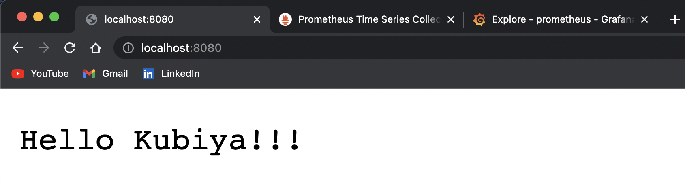
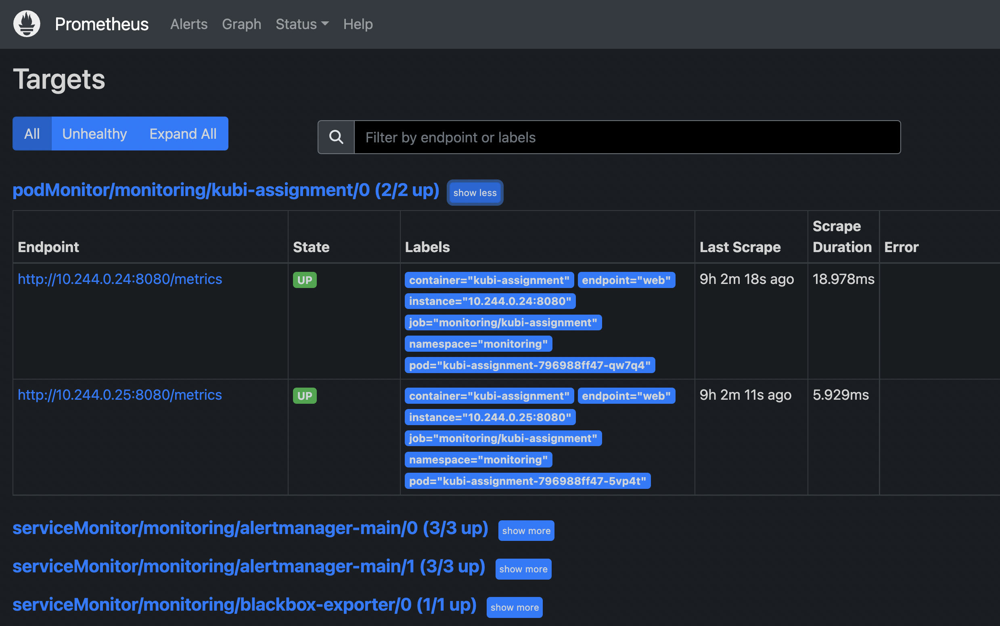
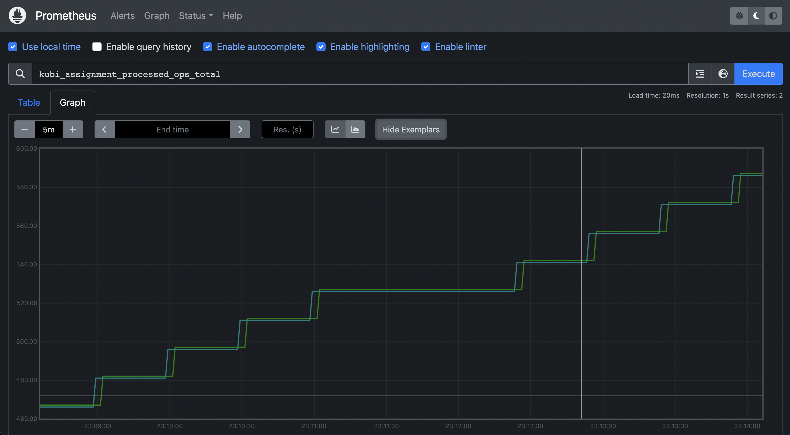
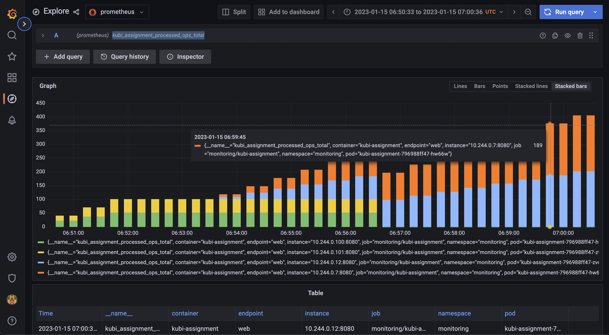

## Summary
This repository includes a simple golang http server instrumented with the Prometheus `prometheus/client_golang` library to expose a custom metric via the `/metrics` endpoint. The k8s resources in `/manifests` create a Custom Resource `PodMonitor` that allows our go client's metric endpoint to be discoverable as a scrape target by our cluster's Prometheus operator. We first create the Prometheus operator in our k8s cluster then we apply the manifests in this repo.

Note: These steps are mostly my scratch and your mileage may vary on running these given your OS, Go, Docker, & local k8s environment.

### Run Go Client Locally

configure dependencies:
* `go mod init kubi-assignment`
* `go get -u -v ./...`

running the project:
* `go run .`
* http server listens on `localhost:8080`
* metrics endpoint available `localhost:8080/metrics`

building the project binary:
* `go build -o app`

### Dockerize Go Client
build & Tag container:
* `docker build -t kubi-assignment .`
* `docker tag kubi-assignment user/kubi-assignment:latest`

login to Dockerhub:
* `docker login`

push local image to Dockerhub registry
* `docker push user/kubi-assignment:latest`

### Install Prometheus Operator to K8s
install `kube-prometheus` operator and monitoring components:
* `git clone git@github.com:prometheus-operator/kube-prometheus.git`

remember to cd into the cloned directory ^^^ before running:
* `kubectl apply --server-side -f manifests/setup`

```bash
kubectl wait \
	--for condition=Established \
	--all CustomResourceDefinition \
	--namespace=monitoring
```

* `kubectl apply -f manifests/`

to delete `kube-prometheus`:
* `kubectl delete --ignore-not-found=true -f manifests/ -f manifests/setup`

### Deploy `kubi-assignment` to K8s

create namespace:
* `kubectl create namespace kubiya`

create deployment:
* `kubectl apply -f ./manifests --namespace=kubiya`

delete deployment:
* `kubectl delete -f ./manifests --namespace=kubiya`

### Access the UIs
a few local `port-forwards` to view GUIs

kubi-assignment:
* `kubectl --namespace monitoring port-forward svc/kubi-assignment-service 8080`
* `localhost:8080`
* `localhost:8080/metrics`

prometheus dashboard:
* `kubectl --namespace monitoring port-forward svc/prometheus-k8s 9090`
* `localhost:9090`

grafana dashboard:
* `kubectl --namespace monitoring port-forward svc/grafana 3000`
* `localhost:3000`




